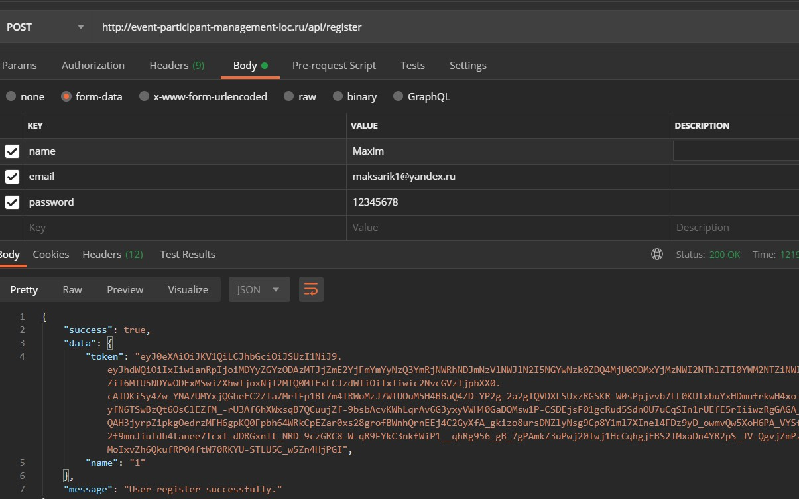
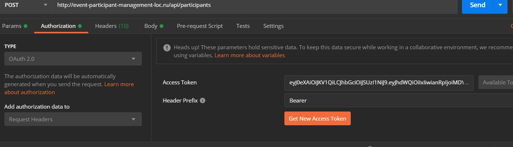
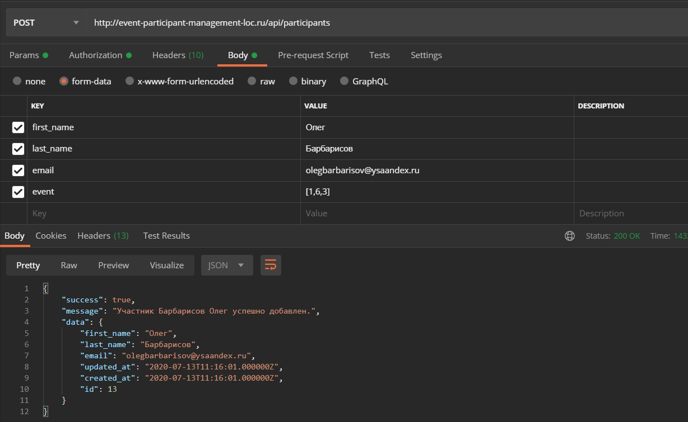

# Event Participant Management 

API-приложение для управления участниками мероприятия.
Реализован на Laravel.

## Приступая к работе

Установить laravel.
Для удобства работы с API удобно использовать программу Postman.
Для работы на клиенте ставим в заголовке(Headers): 

    Accept : application/json

Чтобы работать с Api нужно завести пользователя и получить токен доступа.
Пример, с помощью POST запроса отправляем json, примерный адрес http://event-participant-management-loc.ru/api/register
Для регистрации обязательны следущие поля : name, email, password.

    {
        "name": "Maxim",
        "email": "maksarik1@yandex.ru",
        "password": "12345678"
    }

### Описание проекта

Получив токен доступа, можем работать с Api.

В postman можем поставить на вкладке Authorization наш токен для подключения. Автоматом токен будет в заголовке при запросе.

При запросах заместо event-participant-management-loc.ru будет ваш домен. 

Получить всех участников:

    GET http://{ваш-домен}.ru/api/participants 

Получить информацию о конкретном участнике:

    GET http://{ваш-домен}.ru/api/participants/{participant}

, где  {participant} - id участника

Обновить:

    PUT|PATCH http://{ваш-домен}.ru/api/participants/{participant} 

Удаление:

    DELETE http://{ваш-домен}.ru/api/participants/{participant} 

Данные при добавлении и обновлении:first_name, last_name, email (уникальный и не может повторяться у участников) и event в виде перечисления, массива с id планируемых мероприятий. event: [1,4,7]

###Пример добавления и успешного ответа:

Картинка database_design.png  демонстрирует базу данных, связи.

Также есть возможность посмотреть все мероприятия:

    GET http://{ваш-домен}.ru/api/events 

Участники на конкретном мероприятии:

    GET http://{ваш-домен}.ru/api/events/{id}

, где id конкретного мероприятия   

При запуске проекта, сделать миграцию с заполнением таблиц, будут заполнены базовыми мероприятиями.
Также существуют после успешного добавления нового участника на его email будет отправляться письмо.
На данном этапе пока что пишется в лог, без отправления. Реализовано с помощью очередей.

Проект частично покрыт unit тестами.

